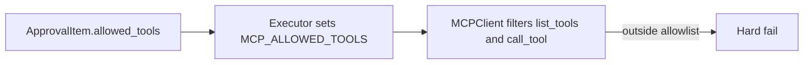

## AgentCore Marketplace

### Features

- FastAPI gateway + Flask Admin UI: /admin, health, config, Slack interactivity, SSE streaming.
- Click CLI: run orchestrations; migrate-config to DynamoDB.
- Slack integration: Events API, signature verification, thread context, async via Step Functions.
- Human-in-the-loop approvals: Separate Lambdas for approval, execution, completion; DynamoDB persistence; Slack/SNS notifications.
- MCP orchestration: Multi-server, Bedrock-powered, per-alias tool disabling, streaming tool calls, and approval-driven tool allowlisting.
- Built-in MCP servers: Google Admin, Google Calendar, Jira, TOTP, GIFs (typed tools via FastMCP).
- AWS/Terraform infra: VPC/networking, IAM (Bedrock, Lambda, Step Functions), DynamoDB (state, sessions, config), Lambda, Step Functions, API Gateway, ECR.
- Config management: config_store for MCP servers and policies; CLI migration from .env/defaults.
- Slack Block Kit helpers: Post/edit, JSON-to-blocks parsing.
- Testing + DX: Extensive pytest suite; uv workflows; Docker support; rich environment.example.

### What it does

Human-in-the-loop AI orchestration for executing tasks via MCP tools (Google, Jira, etc.), with policy checks, approval flows, and a FastAPI gateway. Includes a CLI for direct runs.

- Approval Lambda (`src/approval_handler.lambda_handler`): Creates/updates approval requests, writes to DynamoDB, and sends Slack/SNS notifications; also handles approve/reject callbacks.
- Execute Lambda (`src/execute_handler.lambda_handler`): Executes approved actions via MCP using the stored request, and updates completion status/message in DynamoDB.
- Completion Notifier Lambda (`src/completion_notifier.lambda_handler`): Posts paginated, threaded Slack replies with the final execution result.
- Slack Gateway Lambda (`src/slack_lambda.lambda_handler`): Handles Slack OAuth callback and Events API, verifies signatures, dedupes retries, and triggers the approval/execution workflow.
- API Lambda (`src/api:handler`): FastAPI app packaged with Mangum; exposes `/agent/run`, `/config/*`, `/audit/approvals`, `/slack/interactions`, and mounts the Admin UI under `/admin`.

### How to run

Prereqs: Python 3.11+, UV installed, AWS credentials configured (for Bedrock), and `AWS_REGION` set.

Run API (Docs & Admin): 
```bash
uv run uvicorn src.api:app --host 0.0.0.0 --port 8000 --reload (Docs: http://localhost:8000/docs, Admin: http://localhost:8000/admin)
```
Run CLI: 
```bash
uv run hitl-mcp run --user-id <your email here> --environment dev --query "<your query here>"
```
Run in Docker:
```bash
docker-compose up -d --build
 curl -sS -X POST "http://localhost:9000/2015-03-31/functions/function/invocations" -H "Content-Type: application/json" -d '{"request_id":"02d6b735f14fde47d7f0c5896031c238db719793b3f2d0e2b23e0daf5cb63e76"}'
```
### Approval-aware execution flow

Approvals are tool-call aware and config-driven. The agent proposes an action including the intended MCP tool(s) it expects to use (for example, `google__admin_reset2fa`). The Approval Lambda records these intended tools and stores an explicit allowlist of authorized tool IDs. During execution, only these tools are available; attempts outside the set hard-fail.

```mermaid
flowchart TD
  Q[User Query] --> P[Build ProposedAction\\n(category/resource inference)\\nintended_tools]
  P --> E{Policy}
  E -- Allow --> X[Execute MCP]
  E -- Deny --> D[Stop]
  E -- Require Approval --> A[Approval Lambda\\nstores intended_tools & allowed_tools]
  A --> S[Slack Approve/Reject]
  S -- Approve --> R[Executor loads allowed_tools]
  R --> X
  S -- Reject --> D
```

Execution gating:


### How to test

```bash
uv run pytest -q
```
